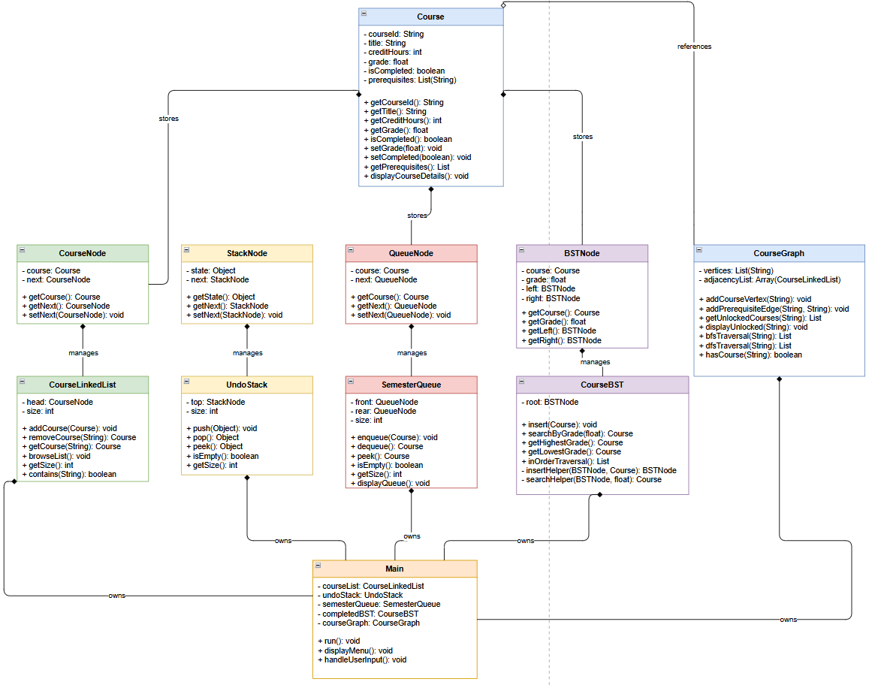

<div align="center">



# Degree Planner System
### Data Structures & Algorithms - Java Implementation


**Ibrahim Abu Kobe - 24120014 - Section 1 - HTU**

</div>

---

## Table of Contents

- [Project Overview](#project-overview)
- [System Menu](#system-menu)
- [Class Diagram](#class-diagram)
- [Data Structures Implemented](#data-structures-implemented)
- [Project Structure](#project-structure)
- [Features](#features)
- [Big O Complexity](#big-o-complexity)
- [How to Run](#how-to-run)
- [Test Cases](#test-cases)
- [OOP Principles Applied](#oop-principles-applied)

---

## Project Overview

This is a **console-based Degree Planner System** built for HTU's Data Structures and Algorithms course (40201201). The system simulates a real-world tool that allows a student to manage their full degree plan, track completed courses, plan upcoming semesters, and visualize course prerequisites.

Every single data structure is built from scratch in Java with no use of the Java Collections Library as required by the assignment.

### What This Project Covers

- Implementing a Singly Linked List from scratch to manage a personal course list
- Implementing a Stack from scratch to support undo functionality
- Implementing a FIFO Queue from scratch for semester registration planning
- Implementing a Binary Search Tree from scratch to search and rank courses by grade
- Implementing a Directed Graph with adjacency list from scratch to model prerequisite unlocking
- Applying full OOP principles including Encapsulation, Abstraction, Inheritance, and Polymorphism
- Error handling, menu-driven interaction, and console-based test reporting

### Project Snapshot

| Detail | Info |
|---|---|
| **Course** | Data Structures and Algorithms - 40201201 |
| **Assignment** | Implementing DSA to solve real-world problems |
| **Language** | Java (OOP) |
| **Package** | dsa_AB |
| **Student** | Ibrahim Abu Kobe - 24120014 |
| **Institution** | Al-Hussein Technical University (HTU) |
| **Submission Date** | 07 June 2026 |
| **Features Implemented** | Feature 1 (Linked List), Feature 2 (Stack), Feature 3 (Queue), Feature 4 (BST), Feature 5 (Graph) |

---

## System Menu

<div align="center">


</div>

---

## Class Diagram

<div align="center">


*Full UML class diagram showing all system classes, attributes, methods, and relationships.*

</div>

---

## Data Structures Implemented

| Feature | Data Structure | Class | Purpose |
|---|---|---|---|
| Feature 1 | Singly Linked List | CourseLinkedList + CourseNode | Manage the full personal course list |
| Feature 2 | Stack (LIFO) | UndoStack + StackNode | Undo the last add or remove action |
| Feature 3 | Queue (FIFO) | SemesterQueue + QueueNode | Plan and process next semester registration |
| Feature 4 | Binary Search Tree | CourseBST + BSTNode | Search courses by grade, find highest and lowest |
| Feature 5 | Directed Graph | CourseGraph + adjacency list | Show which courses a completed course unlocks |
| Support | Custom String List | CustomStringList + StringNode | Store course IDs for graph vertices without Java collections |

---

## Project Structure

```
dsa_AB/
|
|- Course.java             # Core Course object (courseId, title, creditHours, grade, isCompleted, prerequisites)
|
|- CourseNode.java         # Node wrapper for Course - used in the Linked List
|- CourseLinkedList.java   # Feature 1 - Singly Linked List (add, remove, browse)
|
|- StackNode.java          # Node wrapper for Stack - stores any Object state
|- UndoStack.java          # Feature 2 - Stack (push, pop, peek, isEmpty)
|
|- QueueNode.java          # Node wrapper for Queue - stores a Course
|- SemesterQueue.java      # Feature 3 - FIFO Queue (enqueue, dequeue, display)
|
|- BSTNode.java            # Node for BST - stores Course and grade, left and right pointers
|- CourseBST.java          # Feature 4 - BST (insert, searchByGrade, getHighestGrade, getLowestGrade)
|
|- StringNode.java         # Node for CustomStringList - stores a String value
|- CustomStringList.java   # Helper - custom string list used in graph vertices and prerequisites
|- CourseGraph.java        # Feature 5 - Directed Graph with adjacency list
|
|- Main.java               # Entry point - menu driver, user input handler, wires all features together
```

---

## Features

### Feature 1 - Manage Course List (Linked List)

The CourseLinkedList is a custom singly linked list where each CourseNode holds a Course object and a pointer to the next node.

| Method | Description | Time Complexity |
|---|---|---|
| addCourse(Course) | Traverses to the tail and appends a new node | O(n) |
| removeCourse(String) | Traverses to find and unlink the target node | O(n) |
| browseList() | Traverses and prints every node | O(n) |

---

### Feature 2 - Undo Last Action (Stack)

The UndoStack is a custom LIFO stack built with StackNode. Each node stores an Object state such as "ADDED:CS101" or "REMOVED:CS101", making it generic and reusable.

| Method | Description | Time Complexity |
|---|---|---|
| push(Object) | Prepends a new node to the top | O(1) |
| pop() | Removes and returns the top node state | O(1) |
| peek() | Returns the top state without removing | O(1) |
| isEmpty() | Checks if top is null | O(1) |

---

### Feature 3 - Next Semester Queue (Queue)

The SemesterQueue is a custom FIFO queue built with QueueNode. It maintains both a front and rear pointer for constant-time enqueue and dequeue.

| Method | Description | Time Complexity |
|---|---|---|
| enqueue(Course) | Appends to the rear | O(1) |
| dequeue() | Removes from the front | O(1) |
| displayQueue() | Traverses and prints all queued course IDs | O(n) |
| isEmpty() | Checks if front is null | O(1) |

---

### Feature 4 - Search Completed Courses by Grade (BST)

The CourseBST is a custom Binary Search Tree where each BSTNode stores a Course and uses its grade as the key. Only completed courses are inserted.

| Method | Description | Time Complexity |
|---|---|---|
| insert(Course) | Iterative BST insertion by grade | O(log n) average, O(n) worst |
| searchByGrade(float) | Iterative BST search by grade key | O(log n) average |
| getHighestGrade() | Traverses to the rightmost node | O(log n) average |
| getLowestGrade() | Traverses to the leftmost node | O(log n) average |

---

### Feature 5 - What Does This Course Unlock (Graph)

The CourseGraph is a custom directed graph using an adjacency list. Vertices are stored in a CustomStringList and each vertex maps to a CourseLinkedList of courses it unlocks.

| Method | Description | Time Complexity |
|---|---|---|
| addCourseVertex(String) | Adds a course ID as a graph vertex | O(n) |
| addPrerequisiteEdge(String, String) | Adds a directed edge from prereq to target | O(n) |
| getUnlockedCourses(String) | Returns the adjacency list for a given course | O(n) |
| displayUnlocked(String) | Prints all courses unlocked by the given course | O(n) |

Default edges preloaded in Main:
- CS101 unlocks CS201
- CS201 unlocks CS301

---

## Big O Complexity

| Operation | Data Structure | Best Case | Average Case | Worst Case |
|---|---|---|---|---|
| addCourse | Linked List | O(1) | O(n) | O(n) |
| removeCourse | Linked List | O(1) | O(n) | O(n) |
| push / pop | Stack | O(1) | O(1) | O(1) |
| enqueue / dequeue | Queue | O(1) | O(1) | O(1) |
| insert | BST | O(1) | O(log n) | O(n) |
| searchByGrade | BST | O(1) | O(log n) | O(n) |
| getHighestGrade | BST | O(1) | O(log n) | O(n) |
| addPrerequisiteEdge | Graph | O(1) | O(n) | O(n) |
| displayUnlocked | Graph | O(1) | O(n) | O(n) |

---

## How to Run

### Prerequisites

- Java JDK 8 or higher
- Any Java IDE such as IntelliJ IDEA, Eclipse, or VS Code with Java extension

### Steps

1. Clone or download this repository
2. Open the project in your IDE
3. Make sure all files are inside the dsa_AB package
4. Run Main.java
5. Use the numbered menu to interact with the system

### Run from Terminal

```bash
javac dsa_AB/*.java
java dsa_AB.Main
```

---

## Test Cases

| Test Case | Input | Expected Result | Actual Result | Pass/Fail |
|---|---|---|---|---|
| Add a completed course | ID: CS101, Grade: 85 | Course added to list and BST | Course added successfully | Pass |
| Add an incomplete course | ID: CS202, Grade: 0 | Course added to list only, not BST | Course added to list only | Pass |
| Remove an existing course | ID: CS101 | Course removed, undo stack updated | Removed: CS101 | Pass |
| Remove a non-existent course | ID: XXXX | Error message displayed | Error: Course not found in the plan | Pass |
| Undo last action | After adding CS101 | Last action popped from stack | Undo triggered for ADDED:CS101 | Pass |
| Undo with empty stack | No prior actions | Graceful empty message | Nothing to undo. Stack is empty | Pass |
| Queue a course | ID: CS301 | Course enqueued | CS301 added to the registration queue | Pass |
| Display empty queue | No courses queued | Empty message | Queue is currently empty | Pass |
| Find highest graded course | BST with grades 85, 90, 72 | Returns course with grade 90 | Highest Grade: course with 90 | Pass |
| Check unlocked courses CS101 | Input: CS101 | Displays CS201 | CS101 unlocks: CS201 | Pass |
| Check unlocked courses CS201 | Input: CS201 | Displays CS301 | CS201 unlocks: CS301 | Pass |
| Check course with no unlocks | Input: CS301 | No unlocks message | CS301 does not unlock any courses | Pass |
| Invalid menu input | Input: abc | Error message displayed | Invalid menu option | Pass |
| Invalid grade input | Grade: abc | NumberFormatException caught | INPUT ERROR: Please enter a valid number | Pass |

---

## OOP Principles Applied

| Principle | How It Is Applied |
|---|---|
| **Encapsulation** | Every class uses private fields with public getters and setters. Internal node pointers and BST root are never exposed directly |
| **Abstraction** | Each ADT exposes only the operations needed by the caller, hiding traversal and pointer logic internally |
| **Inheritance** | CourseNode, StackNode, QueueNode, and BSTNode all follow a consistent node pattern each tailored to their specific data structure |
| **Polymorphism** | UndoStack stores Object type states allowing it to hold any action string generically without being tied to one data type |

---

<div align="center">

**Ibrahim Abu Kobe** - HTU - Cybersecurity and Data Science

[](https://github.com/ibrahimkobe)
[](https://linkedin.com)

</div>
